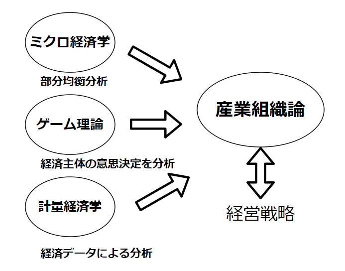
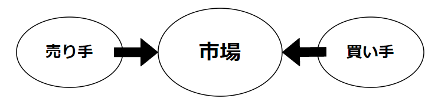
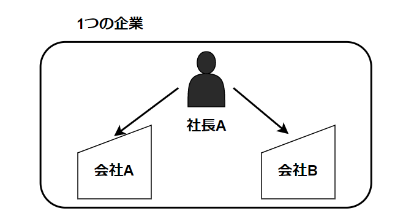

# 産業組織論とは

## 産業組織論とは
- 産業組織論
    - 対象とする産業について、その組織構造や企業や消費者といった市場参加者の行動を分析、評価し、政策提言の基礎を与えることを目指す分野。
    - 「産業組織」は、A.マーシャルが提唱した概念。
        企業内の組織、企業間の関係、企業と国家の関係を含んだ概念

## 産業組織論の歴史
#### アメリカの競争政策
- 19世紀後半　独占企業とトラスト(企業連合)が市場を支配。
- 1890年　シャーマン法が成立
    - トラストやカルテルを禁止
    - 合併による独占企業の成立は可能
- 1914年　**クレイトン法**と**連邦取引委員会法が成立**
    - 独占となる合併の事前規制が可能
- シャーマン法、クレイトン法、連邦取引委員会法が成立
    - 独占となる合併の事前規制が可能
- シャーマン法、クレイトン法、連邦取引委員会法などの法律を総称して、**反トラスト法**と呼ぶ

#### 日本の競争政策
- 1947年　連合国軍総司令部(GHQ)の意向により、独占禁止法が制定
    - 独占禁止法の執行機関として、公正取引委員会が設置される。
    - 独占禁止法では、以下の4つの行為が禁止されている
        - 私的独占
        - 不当な取引制限
            >　カルテルや談合など、共同で決定した価格を守らせる。
        - 不公正な取引方法
        - 競争を実質的に制限することとなる企業結合  
            > 競争を制限する合併や買収を事前に禁止する

____

## 各国の競争政策の評価
- 基本的なミクロ経済学では、資源が有効に利用される効率的な経済が望ましいことから、総余剰を高めることが政策目標になる
- アメリカ：消費者余剰を重視
    - 消費者は多数で利害が拡散、企業は利害が特定企業に集中し、政治的活動をするインセンティブが強くなるため、生産者余剰を重視した政策になるのを防ぐため。
- カナダ、オーストラリア：総余剰を重視。
- 日本
    - 総余剰、消費者余剰に裏付けられた議論はあまりなされていなかった。近年、公正取引委員会の委員に経済学者が参加し、経済学的視点が導入される

____

## 産業と市場
- 産業
    - 産業とは、同一の財を生産し、販売する企業の集団
- 市場
    - 市場とは、売り手と買い手が参加し、同一の財を取引する場。
    - 企業が財の生産をする場合は、売り手の集団が産業となる。

### 企業
- 企業
    - 費用をかけて入手した労働、土地、機械、天然資源等を利用して、財やサービスを生産、販売し、利潤をあげようとする経済主体。
    - 企業の目的は利潤最大化。
    - 何人の労働者を雇うのか、機会を何台導入するか、何個の製品を生産するか、それを何円で販売するかといった意思決定を行う。

### 企業と会社の違い
- 企業は経済「主体」
    - 「主体」には2つの意味がある
        - 契約を結ぶ当事者
        - 意思決定を行う単位

- 会社
    - 会社とは法人とする(会社法 第三条)
    - 法人は、人間ではないが権利や義務を持ち、契約を結ぶこともできる存在
        - 契約を結ぶという観点において、企業と会社は同じ

- 企業と会社の違い
    - 意思決定を行う単位に違いがある
    - 2つの会社を同じ人が完全に所有し、社長として経営を行っている場合、会社としては別個であるが企業としては1つとみなせる。

____

## 日本の企業
### 日本の企業数、事業所数
- 日本全体で、3,983,352の企業が存在している。
    - 全国1位の東京都の企業数は454,254で、国内全体の11.4%を占めている。
- 企業による売上(収入)金額は1403兆円。

|  | 全国 | 東京都 | | 青森県 | |
| :---: | ---: | ---: | ---: | ---: | ---: |
| 企業数 | 3,983,352 | 454,254 | 11.4% | 44,129 | 1.1% |
| 事業所数 | 5,958,554 | 726,480 | 12.2% | 63,401 | 1.1% |
| 従業員数(人) | 62,364,437 | 9,612,367 | 15.4% | 585,840 | 0.9% | 
| 売上金額(億円) | 14,036,505 | 6,731,572 | 48.0% | 58,608 | 0.4% |

> 資料: 平成26年経済センサス-基礎調査

### 民間事業所数、従業者数の増減率
- 平成24年と比較すると、全国で民間事業所数が0.7%増加し、従業者数も3.9%増加。
    - 青森県の民間事業所数は減少しているが、従業者数は増加。

|  | H26年 | ---- | ---- | ---- | H24年 | ---- |
| :---: | ---: | ---: | ---: | ---: | ---: | ---: |
|  | 事業所数 | 増減率 | 従業者数 | 増加率 | 事象所数 | 従業者数 |
| 全国 | 5,810,861 | 0.7% | 58,003,300 | 3.9% | 5,758,489 | 55,837,252 |
| 東京都 | 717,939 | 2.3% | 9,140,353 | 5.6% | 701,848 | 8,655,267 | 
| 青森県 | 61,304 | -0.4% | 518,813 | 3.1% | 61,549 | 503,372 |

> 注: 国及び地方公共団体の事業所を除いたもの  
資料: 平成26年経済センサス-基礎調査

# 企業の種類

**有限責任**: 会社が破産した場合、出資額を没収される、もしくは株式が無価値になるが、それ以上の負債を弁済する責任はない。  
**無限責任**: 会社が破産した場合、個人の資産を提供して負債を弁済する責任を負う。  
**持分会社**: 合名会社、合資会社、合同会社を合わせたもの。

### 企業種類別の企業数

|  | 株式会社 | 持分会社 | 個人企業 |
| :---: | ---: | ---: | ---: |
| 企業数 | 1,647,608 | 27,835 | 2,053,189 |

> 注: 株式会社には、有限会社、相互会社も含む。  
資料: 平成26年経済センサス-基礎調査

### 企業規模別の企業数

|  | 中小企業 | 割合 | 大企業 | 割合 | 合計 |
| :---: | ---: | ---: | ---: | ---: | ---: |
| 企業数(一部産業を除く) | 4,201,264 | 99.7% | 11,926 | 0.3% | 4,213,190 |

> 注: 中小企業とは、常用雇用者300人以下、または資本金3億円以下の企業とする。  
資料: 平成22年経済センサス-基礎調査