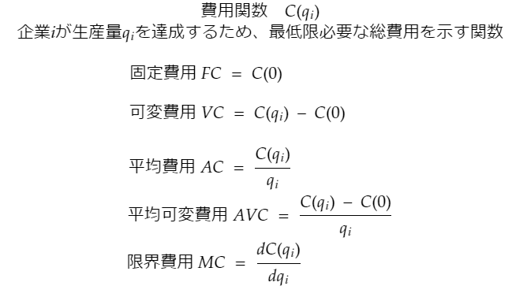

# 企業とは

- 企業
    - 費用をかけて入手した労働、土地、機械、天然資源などを利用して、財やサービスを生産、販売し、利潤を上げようとする経済主体。
    - 企業の目的は利潤最大化。
    - 何人の労働者を雇うのか、機会を何台導入するか、何個の製品を生産するか、それを何円で販売するかといった意思決定を行う。

### 利潤
- 利潤(π)
    - 総収入から総費用を引いたもの。
    - 総収入
        - ある価格で財を販売することで得られる収入。
        - 財の価格pと販売量qをかけたもの

**利潤**  
>**=総収入-総費用**  
**=価格*販売量-(可変費用+固定費用)**  
  
π = qp - ( FC + VC )

- 利潤と利益
    - 経済学の「利潤」と「利益」は異なる。
        - 経済学では機会費用を考慮するため、利潤が利益より小さくなる。
        - 機会費用
            - あるものを獲得するために諦めたもののこと。
    - ある企業が、貯蓄していた30万円から機械を購入し、生産した財から50万円の収入を得た。この時の利潤はいくらになるか？
        - 経済学上の費用には、購入資金の30万円だけでなく諦めた預金金利が含まれる。
            - 30万円を預金していた場合の利子を5%とすると、預金金利は1.5万円

        図が入るよ

____

### 企業活動にかかる費用
- 固定費用(FC)
    - 生産を行わない場合でも必要な費用。
    - 工場の建設費、機械購入の費用
 
- 可変費用(VC)
    - 生産の大きさによって必要になる費用
    - 原材料の調達費用、アルバイトの人件費
 
- 総費用(TC)
    - 固定費用と可変費用の合計

### さまざまな費用
- 平均費用(AC)
    - 総費用を生産量で割ったもの
 
- 平均可変費用(AVC)
    - 可変費用を生産量で割ったもの
 
- 限界費用(MC)
    - 生産量をほんの少し増やすために必要な費用

### 事例
- ケーキ屋
    - 固定費用:中程度(不動産、オーブン)
    - 限界費用:ほぼ一定(労働、材料)
 
- 電力会社
    - 固定費用:莫大(発電所、送電設備)
    - 限界費用:減少
 
- 音楽
    - 固定費用:ある程度大(レコーディング)
    - 限界費用:わずかで一定(配信)

____

### 費用関数  
  

### 費用曲線

一般的な費用曲線  
  

### 平均費用曲線と限界費用曲線
一般的な(U字型の)平均費用曲線と限界費用曲線  
  

### 線形の費用関数
  
線形の費用関数における平均費用曲線と限界費用曲線  

線形の費用関数(固定費用ゼロ)における平均費用曲線と限界費用曲線  

### モデル